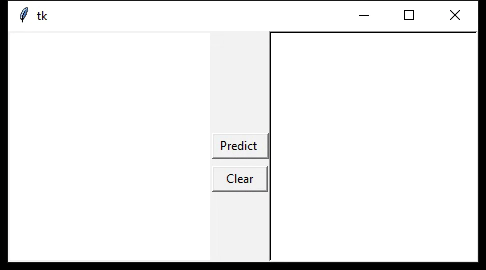

# Handwritten Arabic letters recognition

Machine Learning Python application to recognize Arabic letters using the **classfier k-NN** and the **descriptor LBP**. 

### Contributors
   **Fatiha HAMMA** (<a href="https://www.github.com/kevinarvai/05-bhayta">@05-byhata</a>)

