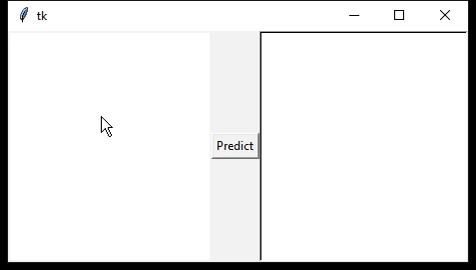
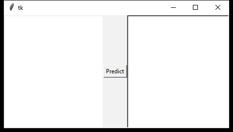

# Handwritten Arabic letters recognition

Machine Learning based application to recognize Arabic letters. It used the classifier k-NN and the descriptor LBP. 

 

### Contributors
 >**Fatiha HAMMA** (<a href="https://www.github.com/kevinarvai/05-bhayta">@05-byhata</a>)

